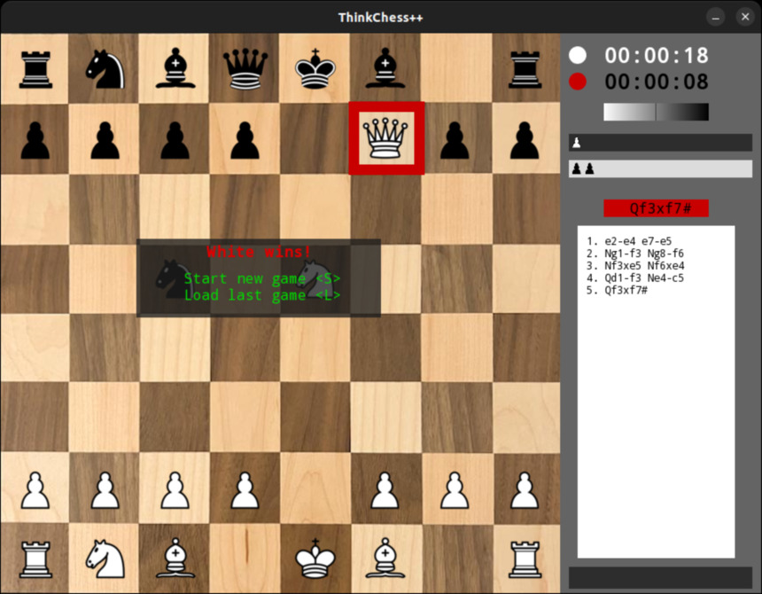

# ThinkChess++
## Build a chess app with C++ and learn to play along the way

If you have ever wondered how to program a simple chess app for yourself,
this tutorial is the right starting point.

We are going to explore the mechanics of the game,
how to maintain and display the gamestate,
and how to find a good next move.

After working through this tutorial, you will not only have a running chess app,
but also be proficient in playing chess at an amateur level.

## Installation
1. clone the repository
1. change to your local copy
1. initialize the build system with `cmake -B build`
1. change to the **build** directory and execute `cmake --build .`
1. start the app with `./ThinkChess`

## Requirements
You will need to have the following components installed on your machine:
* a decent C++ compiler (any of the major compilers will do)
* the *git* tool
* the *cmake* tool
* the required system packages for [SFML](https://www.sfml-dev.org/tutorials/2.6/start-cmake.php)

On Linux, all those components can be installed with your systems package
manager (e.g. with apt-get on ubuntu).

For Mac OS, just use the included clang++ compiler and install missing components with
[homebrew](https://brew.sh/): `brew install git cmake sfml`

## Follow along the tutorial
This repository has several branches, each dedicated to a chapter of the tutorial.
If you want to follow along the tutorial, check out the code for that chapter, e.g.
`git checkout chap1`, and start working on the code from there.

The tutorial itself comes as a html file and is located in the `docs` directory.
If you have [pandoc](https://pandoc.org/) installed on your machine, you can also build
the documentation with `pandoc -dhtml` from that folder, which will produce
the tutorial up to the given chapter.

