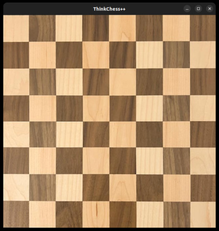
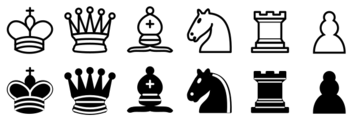
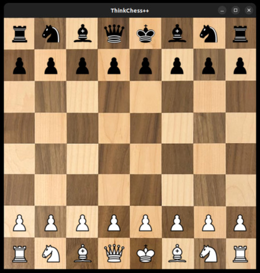
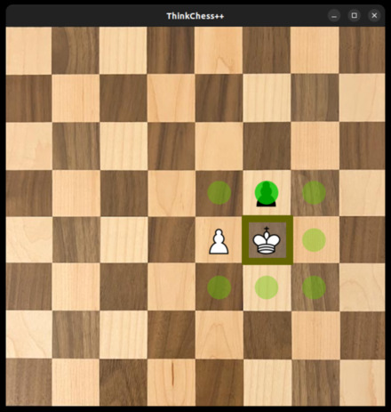
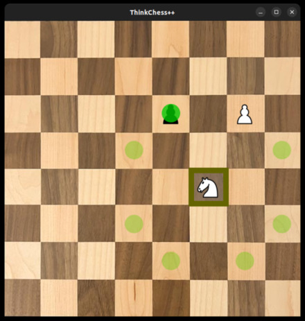
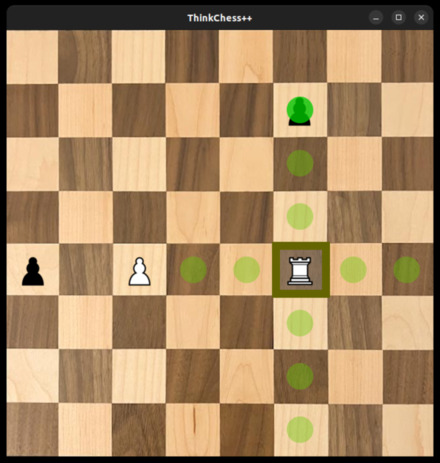
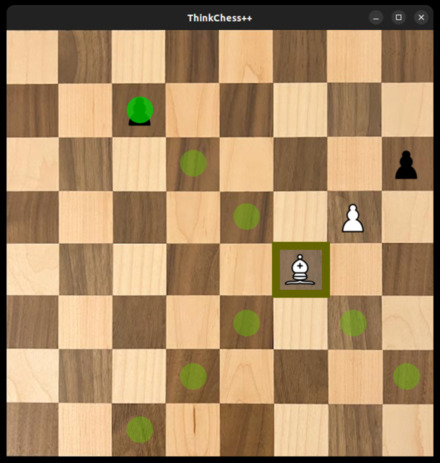
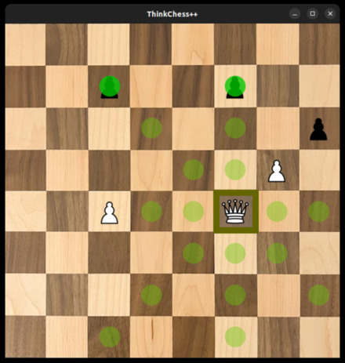
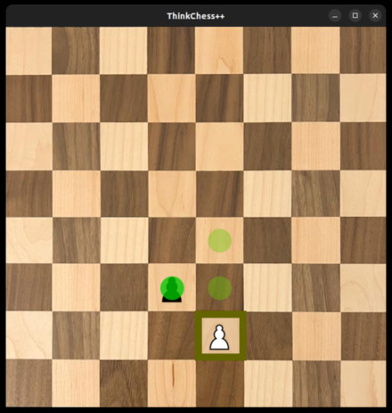

# Display the Game

I've chosen the *Simple and Fast Multimedia Library*
[SFML](https://www.sfml-dev.org/index.php) for creating the graphical
user interface of the app.
It lives up to its name and is available on all major platforms and
programming languages.

In this chapter we'll learn how to display the board and the chess
pieces on it.
In order to show valid moves for each piece, we will also
learn the basic rules of the game.

I'm using [CMake](https://cmake.org/) for building the C^++^ code, and
the SFML CMake project template, which will build the SFML libraries.
So you will need to have the following components installed on your
machine:

-   a decent C^++^ compiler (any of the major compilers will do)
-   the *git* tool
-   the *cmake* tool
-   the required system packages for
    [SFML](https://www.sfml-dev.org/tutorials/2.6/start-cmake.php)

On a Linux system, all those components can be installed with your
systems package manager (e.g. with `apt-get` on Ubuntu).
For Mac OS, just use the included `clang++` compiler and install
missing components with [homebrew](https://brew.sh/):
`brew install git cmake sfml`{.zsh}.

When everything is in place, just clone my repository with
`git clone https://github.com/okrischer/ThinkChess.git`{.zsh}
and execute `cmake -B build`{.zsh} from the root folder of your local copy.
If everything went well, change to the `build` folder and execute
`cmake –build .`{.zsh}.
Voila, you have a simple chess app, which you can start with
`./ThinkChess`{.zsh}.

I strongly encourage you to code all the following steps with an editor
of your choice for yourself and see if you can get the code running.
Nothing is gained if you just skim over the provided source code.

If you have LaTeX installed on your machine, you can also build the
documentation with `pdflatex -shell-escape ThinkChess++.tex`{.zsh} from the
`doc` folder, which will produce this document.

Starting with chapter 4, I've changed the documentation format to `markdown`,
from which you can create a standalone html-document with
`pandoc -dhtml`{.zsh}, once you have the versatile conversion tool
[pandoc](https://pandoc.org/) installed.

## Displaying the board and the pieces

Let's start with the basic framework for displaying something with SFML:

``` {.cpp .numberLines}
#include <SFML/Graphics.hpp>

int main() {
  sf::ContextSettings settings;
  settings.antialiasingLevel = 8;

  auto window = sf::RenderWindow{ {640u, 640u},
                "ThinkChess++",
                sf::Style::Default, settings };

  window.setFramerateLimit(10);

  while (window.isOpen()) {
    for (auto event = sf::Event{}; window.pollEvent(event);) {
      if (event.type == sf::Event::Closed) {
        window.close();
      }
    }
    window.draw(bs);
    window.display();
  }
}
```

This is the main file for our app (`app/main.cpp`).
Thus, it defines the `int main()` function (3) as the starting point of the app
(*note*: the numbers in parenthesis `(x)` always refer to the last code snippet).

In order to access SFML functionality, we have to `#include`{.cpp} the
SFML Graphics library (1), which was built by *cmake*.

First, we define the context (4) and set the antialiasing level to 8
within the context (5).
Next, we define the main window for our app (6), setting its size,
title, style, and the context settings.
Then we set the framerate to 10 (8), i.e. 10 frames per second; we don't
need more for such a static app, and the app will keep responsive with
that.
Next comes the central part: entering the main game loop (10-18).\
The game loop usually contains three steps:

1.  an event loop, processing all user inputs for the current frame
    (11-15)
2.  several drawing instructions (16) for all items to appear in the
    frame
3.  a call to `window.display()`{.cpp}, which causes all drawn elements
    to be actually displayed.

### The board

We don't have anything to draw yet; let's change this by adding a
chessboard within the main function, just before entering the game loop:

``` {.cpp .numberLines}
sf::Texture bi;
bi.loadFromFile("../img/chessboard.jpg");
sf::Sprite bs; bs.setTexture(bi);
```

Here, we create a SFML texture (1) and load an image from the file
system into that texture (2).\
Then we create a SFML sprite (3) and set its texture to that image (4).

If you run the app now, you would see an empty chess board:



### The pieces {#subsec:pieces}

Not that interesting so far, so we're going to add the chess pieces at
their initial position. For that, let's introduce the pieces at first:
they come in two colors, *white* and *black*, each for one player, and
they are called as follows (from left to right in the image below):



  | Piece    | King | Queen | Bishop | Knight | Rook | Pawn |
  |:---------|:----:|:-----:|:------:|:------:|:----:|:----:|
  | quantity |   1  |   1   |    2   |    2   |   2  |   8  |
  | value    |   -  |   8   |    3   |    3   |   4  |   1  |

Every piece, except the king, has a value assigned to it.
This is just by convention and not necessary for the original game play.
The value indicates the strength of the piece and serves for a basic
evaluation of each players position during the game.

The *Queen* is the most powerful piece in the game, followed by the
*Rook*; those two are also called *major pieces*.\
Then we have the *Bishop* and the *Knight*, both of equal value,
building the group of *minor pieces*.\
The least worthy piece is the *Pawn*.

But why has the *King* no value assigned?\
The goal of the game is to put your opponents *King* in a position,
where it is attacked by any of your own pieces (an attack is the threat
to capture a piece with the next move).
We call this position *check*.\
If a player cannot respond to a *check* in the very next move (i.e.
defend his *King*), the game is over, and that player has lost the game.
We call this position *checkmate*.\
Thus, the *King* is never actually captured, it stays on the board until
the end of the game.
With that, it doesn't make any sense to give it a value for evaluating a
players position.

We'll cover the movement of the pieces in great detail in the section
about [valid moves](#sec:validmoves).
But, for now, let's concentrate on how to display the pieces:

``` {.cpp .numberLines}
sf::Texture figures;
figures.loadFromFile("../img/figures.png");

sf::Sprite wk; wk.setTexture(figures);
wk.setTextureRect(sf::IntRect(0,0,60,60));

sf::Sprite bk; bk.setTexture(figures);
bk.setTextureRect(sf::IntRect(0,60,60,60));
// --- snip ---
```

We have loaded a texture, containing the figures of all pieces (2).
Then we define distinct sprites for every piece, calling them *wk* for the
white king (4), *bk* for the black king (8), and so forth.\
Finally, we cut out the matching parts of the `figures` texture
and assign them to every distinct sprite (6, 10).

Notice, that I've taken care that all the sprites have the same size of
$60 \times 60$ pixels.
As the board has a size of $640 \times 640$ pixels, containing $8 \times 8$
light and dark squares, every square on the board has a size of $80 \times 80$
pixels.
That allows us to place the sprites evenly on the board with an offset of 10
pixels to the boundary of each square.

### Keeping track of the pieces

In order to actually place the pieces on the board, we need a data
structure, being able to keep track of the 64 squares.
As it turns out, an $8 \times 8$ vector matrix is a good fit for that:
`vector<vector<Piece*>> board(8, vector<Piece*>(8))`{.cpp}.

We could have used any type of vector matrix for keeping track of the
pieces, but I've chosen an *object-oriented* approach:\
every piece is represented by a raw pointer (indicated with the \*) to
an instance of the type `Piece`.
That allows for greater flexibility implementing the game logic:
instead of putting the logic for the pieces in the main
file, we are going to implement it in a new file `app/pieces.cpp`.

So, let's have a look on how `Piece` is actually implemented:

``` {.cpp .numberLines}
#pragma once
#include <vector>

using namespace std;

// public interface for pieces
class Piece {
public:
  virtual ~Piece() {}
  virtual char getType() = 0;
  virtual char getValue() = 0;
  virtual bool isWhite() = 0;
  virtual bool isCaptured() = 0;
  virtual int getRow() = 0;
  virtual int getCol() = 0;
  virtual void capture() = 0;
  virtual bool isValid(vector<vector<Piece*>>& bd, int r, int c) = 0;
};
```

As you may have guessed, this code snippet is not from the `pieces.cpp`
file, but from its *header* file, located at `include/pieces.hpp`.
I've decided to separate the compilation units into a public interface
(the header file) and an implementation file.
That allows to use the definitions of the header file in any other
implementation file and gives us even more flexibility in structuring
the source code.

`Piece` is declared as a pure *abstract* interface.
That means, it doesn't have a *constructor*, and all the member functions
are marked as `virtual`.
Thus, you cannot instantiate it directly, and to make any use of it,
we have to create *derived* classes (subclasses of`Piece`) for every piece,
which will implement the virtual functions.
The reason for doing so is: we need different implementations
for performing moves for each piece, but also a common type for storing
them in the board matrix.

The concrete types for `Piece` are implemented like so:

``` {.cpp .numberLines}
class King : public Piece {
public:
  ~King() {}
  King(bool w, int r, int c) : type{'K'}, white{w}, value{0},
                              captured{false}, row{r}, col{c} {}

  char getType() override { return type; }
  char getValue() override { return value; }
  bool isWhite() override { return white; }
  bool isCaptured() override { return captured; }
  int getRow() override { return row; }
  int getCol() override { return col; }
  bool isValid(std::vector<std::vector<Piece*>>& bd, int r, int c)
    override;

private:
  char type;
  bool white;
  short value;
  bool captured;
  int row;
  int col;
};
```

The other pieces are implemented likewise; the only difference between
them so far is the implementation of the member function `isValid` (13).
I decided to leave all the class definitions in the header file,
and moved only the implementation for `isValid` to the file `app/pieces.cpp`.

For now, we are only interested in the type definitions:\
each of them is derived from `class Piece` (1) and has a *destructor* (3),
which will be called by the compiler when an instance of the class is destroyed.
This will happen automatically, whenever an *automatic* variable gets out of scope.
But, if a reference to an instance was created explicitly (using the keyword `new`),
we have to `delete` that object explicitly in order to avoid *memory leaks*.

Next, we have the *constructor* (4-5):\
it initializes a new instance with its type (which we need only for
drawing the correct sprite), the color of the piece (white or black),
its value, and the current position of the piece (the row and column of
the piece in the board matrix).

The following member functions (7-12) are just *getters* to retrieve the
`private` member types.

With the derived `Piece` types in place, we can initially fill the
board matrix:

``` {.cpp .numberLines}
void reset_board(vector<vector<Piece*>>& bd) {
  for (auto rank : bd) {
    for (auto piece : rank) {
      delete piece;
    }
  }
  // rank 8 (black)
  bd[0][0] = new Rook(0,0,0);
  bd[0][1] = new Knight(0,0,1);
  bd[0][2] = new Bishop(0,0,2);
  bd[0][3] = new Queen(0,0,3);
  bd[0][4] = new King(0,0,4);
  bd[0][5] = new Bishop(0,0,5);
  bd[0][6] = new Knight(0,0,6);
  bd[0][7] = new Rook(0,0,7);
  // rank 7 (black)
  bd[1][0] = new Pawn(0,1,0);
  bd[1][1] = new Pawn(0,1,1);
  bd[1][2] = new Pawn(0,1,2);
  bd[1][3] = new Pawn(0,1,3);
  bd[1][4] = new Pawn(0,1,4);
  bd[1][5] = new Pawn(0,1,5);
  bd[1][6] = new Pawn(0,1,6);
  bd[1][7] = new Pawn(0,1,7);
  // rank 2 (white)
  bd[6][0] = new Pawn(1,6,0);
  bd[6][1] = new Pawn(1,6,1);
  bd[6][2] = new Pawn(1,6,2);
  bd[6][3] = new Pawn(1,6,3);
  bd[6][4] = new Pawn(1,6,4);
  bd[6][5] = new Pawn(1,6,5);
  bd[6][6] = new Pawn(1,6,6);
  bd[6][7] = new Pawn(1,6,7);
  // rank 1 (white)
  bd[7][0] = new Rook(1,7,0);
  bd[7][1] = new Knight(1,7,1);
  bd[7][2] = new Bishop(1,7,2);
  bd[7][3] = new Queen(1,7,3);
  bd[7][4] = new King(1,7,4);
  bd[7][5] = new Bishop(1,7,5);
  bd[7][6] = new Knight(1,7,6);
  bd[7][7] = new Rook(1,7,7);
}
```

That seems tedious, but thankfully we have to do this only once.
I've placed the initialization code within a function
`void reset_board`, just in case we want to reset the board
later (e.g. when starting a new game).
The board is passed as an automatic reference to the function
(indicated by the & after the parameter type), such that we are able
to modify the board directly, instead of working with a copy of the board.

The code in the first three lines actually resets the board by deleting
all existing references to pieces.
When setting the pieces, you have to be careful:
every piece must be initialized with exactly the same coordinates from the board
(and of course with the correct color: 0 for black and 1 for white).

The rows of a chessboard are called *ranks*, while the columns are called *files*.
The ranks are indicated by the numbers 1 to 8, whereas the files are indicated
by the letters `a` to `h`, both starting at the lower left square (the dark field `a1`):

    8 . . . . . . . .
    7 . . . . . . . .
    6 . . . . . . . .
    5 . . . . . . . .
    4 . . . . . . . .
    3 . . . . . . . .
    2 . . . . . . . .
    1 . . . . . . . .
      a b c d e f g h

With the initialization code above, the pieces will be placed like so on
the board:

    8 R N B Q K B N R
    7 P P P P P P P P
    6 . . . . . . . .
    5 . . . . . . . .
    4 . . . . . . . .
    3 . . . . . . . .
    2 P P P P P P P P
    1 R N B Q K B N R
      a b c d e f g h

Observe that we abbreviate the *Knight* with the letter `N` to avoid
confusion with the *King*.
So, the white *Queen* is placed at `d1`, the black *Queen* at `d8`, and so forth.

### Drawing the pieces

Now we can use the filled board matrix to actually draw the pieces
within the game loop of the main function:

``` {.cpp .numberLines}
// draw board
window.draw(bs);
// draw pieces
for (int row = 0; row < 8; row++) {
  for (int col = 0; col < 8; col++) {
    if (board[row][col]) {
      auto piece = board[row][col];
      sf::Sprite pc;
      switch (piece->getType()) {
      case 'K':
        piece->isWhite() ? pc = wk : pc = bk;
        break;
      case 'Q':
        piece->isWhite() ? pc = wq : pc = bq;
        break;
      case 'R':
        piece->isWhite() ? pc = wr : pc = br;
        break;
      case 'B':
        piece->isWhite() ? pc = wb : pc = bb;
        break;
      case 'N':
        piece->isWhite() ? pc = wn : pc = bn;
        break;
      case 'P':
        piece->isWhite() ? pc = wp : pc = bp;
        break;
      }
      pc.setPosition(col*80.f + 10.f, row*80.f + 10.f);
      window.draw(pc);
    }
  }
}
```

We are iterating over all elements of the board matrix and get the piece
at this position (7).
Then we get the type and color of that piece by calling the appropriate
getter functions (`getType(), isWhite()`) on it, and let a newly created
sprite `pc` point to the corresponding figure sprite (9-28).
Finally, we set the correct postion of the `pc` sprite on the board (29)
and draw it to the current frame buffer (30).

Observe that we have to use the pointer notation `->` (instead of a dot)
for calling those functions on a piece, as the pieces were actually
defined as pointers.

And that's it: when you start the app now, you will see this screen,
which shows a correct initialized chessboard with all pieces:



## Showing valid moves {#sec:validmoves}

The goal for this section is to show the valid moves for any given piece
on the board.

### Game mechanics

For reaching our goal, we first need a way to process user input.
With SFML this is done inside the event loop of the main function:

``` {.cpp .numberLines}
// in event loop
// mouse button pressed
if (event.type == sf::Event::MouseButtonPressed) {
  if (event.mouseButton.button == sf::Mouse::Right) {
    pair<int, int> f =
      getField(event.mouseButton.x, event.mouseButton.y);
    setValidMoves(board, board[f.first][f.second]);
  }
}
// mouse button released
if (event.type == sf::Event::MouseButtonReleased) {
  if (event.mouseButton.button == sf::Mouse::Right) {
    validMoves =
      vector<vector<short>>(8, vector<short>(8, 0));
  }
}
```

Here, we check if a mouse button is pressed (3).
If so, we check wether it's the right mouse button (4).\
Then, we get the coordinates of the corresponding field on the board (5-6),
and fill another vector matrix with the computed valid moves for the piece
under the mouse cursor (7).

When the right mouse button is released (11-12), we reset the vector
matrix of valid moves (13-14).

In order for that to work, we need the following definitions in the main
file, just before entering the main function:

``` {.cpp .numberLines}
vector<vector<short>> validMoves(8, vector<short>(8, 0));

void setValidMoves(vector<vector<Piece*>>& bd, Piece* pc) {
  if (!pc) return;
  for (int row = 0; row < 8; row++) {
    for (int col = 0; col < 8; col++) {
      if (pc->isValid(bd, row, col)) {
        auto current = bd[row][col];
        if (!current) validMoves[row][col] = 1; 
        else if (pc->isWhite() != current->isWhite())
          validMoves[row][col] = 2;
      }
    }
  }
}

pair<int, int> getField(int x, int y) {
  int fx = x / 80;
  int fy = y / 80;
  auto field = make_pair(fy, fx);
  return field;
}
```

The work is done inside the `setValidMoves` function (3):\
if there's no piece at the given coordinates, do nothing (4).
Otherwise, iterate over all fields of the board (5-6), and check wether this
position can be reached by the piece under the mouse cursor (7).
If so, get the piece of the current search position (8).\
If there is no piece at this position, set this position to valid (9).
Otherwise, check the color of the current piece and if it's different from
the piece under the cursor (i.e. it can be captured), set it to valid with
the special marker 2 (11).

Our *object-oriented* design is starting to pay off, as we don't need to
define any game logic inside the main application file!

The last thing to do, is to draw the content of the `validMoves`
vector inside the main game loop (directly after drawing the pieces):

``` {.cpp .numberLines}
// before game loop
sf::CircleShape valid(20.f);

  // inside game loop
  // draw valid moves
  for (int row = 0; row < 8; row++) {
    for (int col = 0; col < 8; col++) {
      if (validMoves[row][col] > 0) {
        valid.setPosition(col*80.f + 20.f, row*80.f + 20.f);
        if (validMoves[row][col] > 1)
          valid.setFillColor(sf::Color(0, 200, 0, 200));
        else valid.setFillColor(sf::Color(100, 200, 0, 100));
        window.draw(valid);
      }
    }
  }
```

We iterate over all fields of the board (6-7), and if `validMoves`
contains an entry at this position (8), we set the marker `valid`
on the board (9).
As an extra feature, we set the marker to a brighter color,
if the piece at this postion can be captured (10-11).
Finally, we draw the marker on the board (13).

With that, all valid moves for a selected piece are displayed while
pressing the right mouse button (with a green circular shape on the
board).
As soon as you release the mouse botton, the `validMoves`
vector is reset, and there's nothing more to draw for the next frame.

That's all for the mechanics of the game for now.
Of course, we still need to implement the `isValid` function for every piece,
which leads us to the next section.

### Movement of the pieces

#### The King

Let's start with the *King*: it can move one step in any direction (on
ranks, files and diagonals), provided the target field is not occupied
by a piece of the same color:



Observe, that the piece, for which the valid moves are shown (the king
on `f4`), is marked with a dark green frame.
We will learn how to set this marker in [making moves](#sec:makemoves),
so when programming along, you will not see this marker for now.

If the target field is occupied by a piece of the other color (the black
pawn on `f5`), the king can capture that piece, indicated by a brighter
color of the green marker.

But notice: the king is the only piece on the board that is not allowed
to move to a field, where it is immediately attacked, as it would put
itself into a *check* position, and the game would be over.
We're not taking this special case into account yet, so the field `g4`,
which is attacked by the black pawn, is still marked as valid.

Besides that, there's also a special move involving the king, called
*castling*, which we will cover in [special moves](#sec:specmov).

The function `isValid` for the king is implemented in the file
`app/pieces.cpp`:

``` {.cpp .numberLines}
#include "pieces.hpp"
#include <vector>
using namespace std;

bool King::isValid(const vector<vector<Piece*>>& bd, int r, int c) {
  bool valid = abs(r-row) <= 1 && abs(c-col) <= 1;
  return valid;
```

First, we have to include the header file located at `include/pieces.hpp` (1),
in order to make the type definitions of the pieces available.
Observe, that we don't have to spell out the complete path to that file,
thanks to these instructions of our `CMakeLists.txt` file:

```cmake
add_executable(ThinkChess app/main.cpp app/pieces.cpp)
target_include_directories(ThinkChess PUBLIC include)
```

The function `isValid` is actually defined as `King::isValid()`{.cpp} (5),
which makes it a member function of the type `King`.
It returns `true` only if the given coordinates can be reached within
one step.

#### The Knight

The *Knight* is also a very special piece in this sense: it is the only
piece, able to jump over any other piece on the board.
It can move like so: either two fields on a rank and one on a file,
or two on a file and one on a rank. That leads to an L shape for every move:



Observe that a knight, placed on a dark field, can reach only light
fields, and vice versa.

Its `isValid` function is implemented like so:

``` {.cpp .numberLines}
bool Knight::isValid(const vector<vector<Piece*>>& bd, int r, int c) {
  bool valid = (abs(r-row) == 1 && abs(c-col) == 2) ||
               (abs(r-row) == 2 && abs(c-col) == 1);
  return valid;
}
```

#### The Rook

The *Rook* moves any distance on its current rank or file, but cannot
jump over any other piece.



As the rooks movement is limited by other pieces on its way, we have to
take those pieces into account for implementing its `isValid`
function:

``` {.cpp .numberLines}
bool Rook::isValid(const vector<vector<Piece*>>& bd, int r, int c) {
  bool valid = r == row || c == col;
  if (r == row && abs(c-col) > 1) { // same row
    if (c < col) { // left
      for (int cc = c+1; cc < col; cc++) {
        auto pc = bd[r][cc];
        if (pc) { valid = false; break; }
      }
    } else { // right
      for (int cc = col+1; cc < c; cc++) {
        auto pc = bd[r][cc];
        if (pc) { valid = false; break; }
      }
    }
  }
  if (c == col && abs(r-row) > 1) { // same column
    if (r < row) { // top
      for (int rr = r+1; rr < row; rr++) {
        auto pc = bd[rr][c];
        if (pc) { valid = false; break; }
      }
    } else { // down
      for (int rr = row+1; rr < r; rr++) {
        auto pc = bd[rr][c];
        if (pc) { valid = false; break; }
      }
    }
  }
  return valid;
}
```

First, we set the result to `valid` if the given field it is on
the same row or column as the rook(2).
Then, we check for two cases:
-   the field is on the same row (3), or
-   the field is on the same column (16).

In both cases, we check wether there is another piece between the field
and the rook by iterating over all those fields on that row, respective
column.
If so, we set `valid` to `false` and stop the search (7, 12, 20, 25).

We have four searches, for every direction the rook can move: up, down,
left, right.
But only one of them will ever be executed for any given field:
either on the same row *or* on the same column.
As the search-space is very small for each search (at most 6 checks),
we can consider this as a *constant time* search, or in asymptotic
notation $\mathcal{O}(1)$.

#### The Bishop

The *Bishop* can move any distance along the diagonals, on which it is
placed, unless its way is blocked by another piece:



Notice, that a bishop, placed initially on a light field, will always
stay on a light field, and vice versa.
Thus, both players each have a *dark* and a *light* bishop
(the white bishop on `f4` is a *dark* bishop with its initial position on `c1`).
Dark and light bishops can never attack each other.

We use essentially the same logic as for the rook, but this time we
check for pieces on the same diagonal:

``` {.cpp .numberLines}
bool Bishop::isValid(const vector<vector<Piece*>>& bd, int r, int c) {
  bool valid = r-c == row-col || r+c == row+col;
  if (r-c == row-col) { // same major diagonal
    if (r < row) { // upper
      for (int rr = row-1; rr > r; rr--) {
        for (int cc = col-1; cc > c; cc--) {
          if (rr-cc == row-col) {
            auto pc = bd[rr][cc];
            if (pc) { valid = false; break; }
          }
        }
      }
    } else { // lower
      for (int rr = row+1; rr < r; rr++) {
        for (int cc = col+1; cc < c; cc++) {
          if (rr-cc == row-col) {
            auto pc = bd[rr][cc];
            if (pc) { valid = false; break; }
          }
        }
      }
    }
  }
  if (r+c == row+col) { // same minor diagonal
    if (r < row) { // upper
      for (int rr = row-1; rr > r; rr--) {
        for (int cc = col+1; cc < c; cc++) {
          if (rr+cc == row+col) {
            auto pc = bd[rr][cc];
            if (pc) { valid = false; break; }
          }
        }
      }
    } else { // lower
      for (int rr = row+1; rr < r; rr++) {
        for (int cc = col-1; cc > c; cc--) {
          if (rr+cc == row+col) {
            auto pc = bd[rr][cc];
            if (pc) { valid = false; break; }
          }
        }
      }
    }
  }
  return valid;
}
```

Here, we also have four searches:
two for the major diagonal and another two for the minor diagonal.
The searches are now nested loops, as we need to get both coordinates
for the current field.

There are at most $6 \times 6 = 36$ tests per search, and on average
only $3 \times 3 = 9$ tests for each.
And, as before, only one of these searches will ever by executed for any
given field.
So, we may consider these searches as *constant time* searches as well.

#### The Queen

The *Queen* can move any distance in all directions (on its rank, file
or diagonals), only limited by other pieces in its way.
In the image below you can see, why the queen is the strongest piece on the board:



We use a little trick to get the queens valid moves:
as the queen can move like a rook *and* a bishop,
we just check for valid moves for *either* of them:

``` {.cpp .numberLines}
bool Queen::isValid(const vector<vector<Piece*>>& bd, int r, int c) {
  auto rook = new Rook(white, row, col);
  auto bishop = new Bishop(white, row, col);
  bool valid = rook->isValid(bd, r, c) || bishop->isValid(bd, r, c);
  delete rook;
  delete bishop;
  return valid;
}
```

Observe that we have to delete those dummy pieces, in order to prevent
any memory leaks.

#### The Pawn

The last piece to cover is the *Pawn*: it is the weakest piece on the
board, but in exchange, both players have 8 of them.
The movement of the pawns is the most complex of all pieces:

-   **base case**: move straight forward one square on its file, if that
    square is vacant
-   **capturing**: capture an opponents piece on either of the two
    squares diagonally in front of it
-   **initial position**: if the pawn has not yet moved, it has the
    option of moving two squares straight forward, provided both squares
    are vacant.

Notice that the terms *forward* and *in front* always refer to the
direction towards the opponents pieces: the *white* pawns moves to the
higher ranks (e.g. `e2-e4`), while the *black* pawns move towards the
lower ranks (e.g. `d3xe2`).



There are also two special moves involving pawns, called *en passant*
and *promotion*, which we will cover in [special moves](#sec:specmov).

Here's the code to put the rules in action:

``` {.cpp .numberLines}
bool Pawn::isValid(const vector<vector<Piece*>>& bd, int r, int c) {
  bool valid = false;
  auto pc = bd[r][c];
  if (white) {
    if (r == row-1 && c == col) { // move
      if (!pc) valid = true;
    }
    if (row == 6 && r == 4 && c == col) { // initial move
      auto pc1 = bd[5][c];
      if (!pc1 && !pc) valid = true;
    }
    if (r == row-1 && (c == col-1 || c == col+1)) { // capture
      if (pc && pc->isWhite() != white) valid = true;
    }
  } else { // black
    if (r == row+1 && c == col) { // move
      if (!pc) valid = true;
    }
    if (row == 1 && r == 3 && c == col) { // initial move
      auto pc1 = bd[2][c];
      if (!pc1 && !pc) valid = true;
    }
    if (r == row+1 && (c == col-1 || c == col+1)) { // capture
      if (pc && pc->isWhite() != white) valid = true;
    }
  }
  return valid;
}
```

We have to consider white and black pawns separately, as they move in
different directions (4, 15).\
If there's no piece in front of the pawn, it can move to that field (6, 17).\
If the pawn is on its initial position (8, 19), it also can move two
squares ahead, if both fields ahead aren't occupied (10, 24).\
If there's a piece diagonal in front of the pawn (12, 23), it can be captured,
if it is of the other color (13,24).
