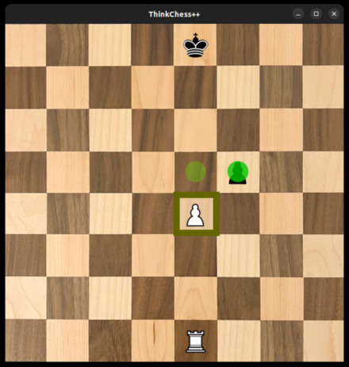
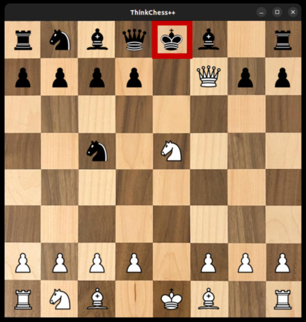
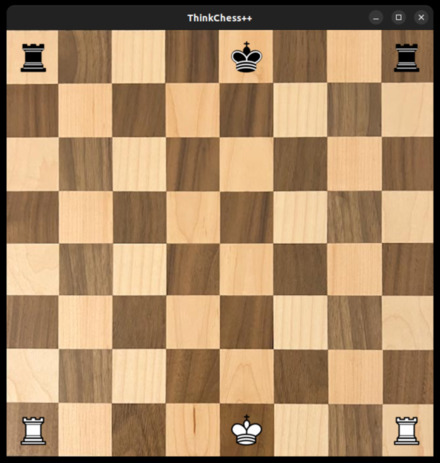
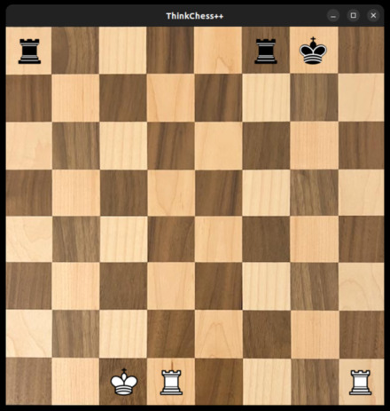
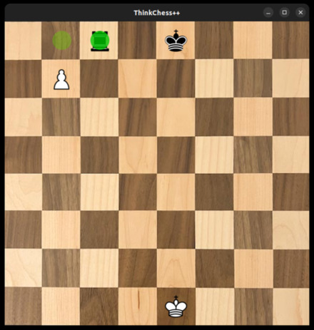

# Play the Game

Now that we have a board with the pieces on it, we actually want to play
the game.

To that goal, we will explore how to make moves and store them for later usage.

Finally, we will consider special moves and positions to improve the game play.

## Making Moves {#sec:makemoves}

The first thing we need for making moves, is a way to process user input.
We’ll do that inside the event loop of the main function:

``` {.cpp .numberLines}
// mouse button pressed
if (event.type == sf::Event::MouseButtonPressed) {
  if (event.mouseButton.button == sf::Mouse::Left) {
    pair<int, int> f = getField(event.mouseButton.x,
                                event.mouseButton.y);
    if (touched.first == -1) touched = f;
    else if (f == touched) touched = {-1, -1};
  }
}
// mouse button released
if (event.type == sf::Event::MouseButtonReleased) {
  if (event.mouseButton.button == sf::Mouse::Left) {
    pair<int, int> f = getField(event.mouseButton.x,
                                event.mouseButton.y);
    if (touched.first != -1 && touched != f)
      makeMove(board, moves, captured, touched, f, player);
  }
}

// get board coordinates
pair<int, int> getField(int x, int y) {
  int fx = x / 80;
  int fy = y / 80;
  auto field = make_pair(fy, fx);
  return field;
}
```

We’re using the *left* mouse button for making moves (3, 12); remember
that we’ve used the right button for showing valid moves.

First, we need the coordinates of the board, where the mouse button was
pressed (4), respectively released (13).\
When *pressing* the button, and no field was touched yet (6), we set the
variable `pair<int,int> touched` to those coordinates.
But if a field was already touched, and it’s the current field, we reset
`touched` (7).

When *releasing* the button, we check wether a field was touched (15),
and if it’s not the current field, we make a move from the touched to
the current field (16).

With this mechanism, we can make a move in two ways:

-   *drag-and-drop*: just move a piece from its current position to the
    target, while holding the left mouse button
-   *click twice*: click once on the piece to move, and a second time on
    the target field.

The `getField()` function (21-26) converts the coordinates of the mouse
cursor to the coordinates of the board matrix.
Observe that it returns the coordinates in that order:
first the row index, second the column index.

In order to clean up the design, I decided to do some refactorings:
I moved all function definitions, except the main function, to a separate
implementation file `app/moves.cpp`;
and I moved all variable definitions into the main function, to get rid of
global variables.

So, we’ll have the following definitions inside the main function:

``` {.cpp .numberLines}
// matrix of pieces representing the board
vector<vector<Piece*>> board(8, vector<Piece*>(8));

// matrix of valid moves for display
vector<vector<short>> validMoves(8, vector<short>(8, 0));

// list of moves, used as a stack
auto* moves = new list::List<string>;

// list of captured pieces, used as a stack
auto* captured = new list::List<Piece*>;

// touched field for making moves
pair<int, int> touched{-1, -1};

// player to turn, starting with white
bool player = true;
```

The variables `moves` and `captures` are *linked lists*, which I’ve
implemented in a separate library called `datastructures` within a
namespace `list`.
I will not go into details here, but if you are interested in implementing
a linked list for yourself, have a look at the file `include/list.hpp` in that
directory (it’s quite well documented, so you should find your way around).

But now, to the most important function of this section: `makeMove()`.

``` {.cpp .numberLines}
void makeMove(vector<vector<Piece*>>& bd,
              list::List<string>* mv,
              list::List<Piece*>* cp,
              pair<int, int>& td,
              pair<int, int> to,
              bool& player)
{
  auto pcf = bd[td.first][td.second];
  auto pct = bd[to.first][to.second];
  bool cap = false;
  if (!pcf) {
    cout << "no piece under cursor\n";
    td = {-1, -1};
    return;
  }
  if (pcf->isWhite() != player) {
    cout << "it's not your turn\n";
    td = {-1, -1};
    return;
  }
  if (pcf->isValid(bd, to.first, to.second)) {
    if (pct && pct->isWhite() != pcf->isWhite()) {
      cap = true;
      pct->capture();
      cp->push_front(pct);
    } else if (pct) {
      cout << "illegal move!\n";
      td = {-1, -1};
      return;
    }
    mv->push_front(convertFromBoard(cap, pcf, to));
    bd[to.first][to.second] = pcf;
    bd[td.first][td.second] = nullptr;
    pcf->makeMove(to.first, to.second);
    td = {-1, -1};
    player = !player;
    cout << mv->peek(1) << "\n";
  // illegal move
  } else {
    cout << "illegal move!\n";
    td = {-1, -1};
  }
}
```

First, we get the pieces of the start (`td`, the touched field) and
target coordinates (`to`) of the move(8, 9).\
If there’s no piece at the start coordinates (11), reset the touched
field (13) and abort the move (14).\
If the color of the start piece doesn’t match the player, whose turn it
is (16), also abort the move (19).

Otherwise, check wether the move is valid (21), and wether the piece at
the target position can be captured (22).\
If so, capture the piece (24) and push it onto the stack of captured
pieces (25).
Otherwise, if there’s a piece of the same color (26), abort the move
(29).

So far, we’ve checked all the possible variations and have a valid move;
thus, we add the move to the stack of moves (31).
Then, we set the piece under the cursor to its target position on the
board (32), overwriting the old reference, and delete its old position
(33).

Finally, we tell the piece its new position (34), reset the touched
field (35), and switch to the other player (36).

For pushing the move onto the moves stack, I used a function
`convertFromBoard` (31), which is defined like so:

``` {.cpp .numberLines}
string convertFromBoard(bool cap, Piece* from, pair<int, int> to) {
  string move;
  char type = from->getType();
  if (type != 'P') {
    move.append(1, type);
  }
  move.append(1, colToFile(from->getCol()));
  move.append(1, rowToRank(from->getRow()));
  if (cap) {
    move.append(1, 'x');
  } else {
    move.append(1, '-');
  }
  move.append(1, colToFile(to.second));
  move.append(1, rowToRank(to.first));
  return move;
}

char colToFile(int col) {
  char file = 97 + col;
  return file;
}

char rowToRank(int row) {
  char rank = 56 - row;
  return rank;
}
```

The function takes a piece (`from`) and target coordinates (`to`) as
parameters, and converts them into a string of
[algebraic chessnotation](https://en.wikipedia.org/wiki/Algebraic_notation_(chess)).
It makes use of two helper functions `colToFile()` and `rowToRank()`,
which convert the coordinates of the board matrix to chess coordinates.

Those functions use a little trick, based on the specification of the
`char` type in C^++^: the actual value of a character is stored
as a `short int`, based on the ascii code for that character.
So, the letter ‘a’ is stored internally as 97, and the digit ‘8’ as 56.
We use this fact for a simple calculation.

The only thing left to do is to adjust the `resetBoard()` function to
take care of the moves stack and the captured pieces:

``` {.cpp .numberLines}
void resetBoard(vector<vector<Piece*>>& bd,
                 list::List<string>* mv,
                 list::List<Piece*>* cp)
{
  // reset moves and captured pieces
  delete mv;
  mv = new list::List<string>;
  delete cp;
  cp = new list::List<Piece*>;
  // reset board
  for (auto rank : bd) {
    for (auto piece : rank) {
      delete piece;
    }
  }
  // --- snip ---
}
```

We have to explicitly delete the moves stack and the stack of captured
pieces when resetting to board, in order to avoid memory leaks.
But then, we have to create them again as empty lists, as we want to use
them for the next game.
Notice, that not only the references to those lists are deleted,
but also all elements inside the lists, due to that destructor in the file
`datastructures/include/list.hpp`:

``` {.cpp .numberLines}
template<typename T>
class List : public LL<T> {
public:
  ~List() {
    Node* node = head;
    while(node) {
      Node* curr = node;
      node = node->next;
      delete curr;
    }
    delete node;
  }
}
```
The very last thing, we want to do in this section, is to add a marker
inside the main function for the touched piece on the board

``` {.cpp .numberLines}
sf::RectangleShape frame(sf::Vector2f(63.f, 60.f));
frame.setFillColor(sf::Color(200, 200, 200, 50));
frame.setOutlineThickness(12.f);
frame.setOutlineColor(sf::Color(100, 100, 0));
```
and draw it together with the pieces inside the game loop:

``` {.cpp .numberLines}
// draw pieces
for (int row = 0; row < 8; row++) {
  for (int col = 0; col < 8; col++) {
    if (board[row][col]) {
      auto piece = board[row][col];
      // --- snip ---
      if (row == touched.first && col == touched.second) {
        frame.setPosition(col*80.f + 10.f, row*80.f + 10.f);
        window.draw(frame);
      }
      pc.setPosition(col*80.f + 10.f, row*80.f + 10.f);
      window.draw(pc);
    }
  }
}
```
## Special Positions {#sec:specpos}

### Check and checkmate

The most prominent position in a game is the
[check](https://en.wikipedia.org/wiki/Check_(chess)), where the king is
under immediate attack.
So far, we have no mechanism to respond to or even detect a *check*.
Let’s change that now.

For that, we only need to iterate over all opponent pieces, and if any
of them can reach the king with a valid move, we have a check:

``` {.cpp .numberLines}
bool check(vector<vector<Piece*>>& bd, bool white) {
  Piece* king;
  bool check = false;
  for (int row = 0; row < 8; row++) {
    for (int col = 0; col < 8; col++) {
      auto current = bd[row][col];
      if (current && current->getType() == 'K' &&
          current->isWhite() == white)
      {
        king = current;
      }
    }
  }
  for (int row = 0; row < 8; row++) {
    for (int col = 0; col < 8; col++) {
      auto current = bd[row][col];
      if (current && current->isWhite() != white) {
        if (current->isValid(bd, king->getRow(), king->getCol())) {
          check = true;
        }
      }
    }
  }
  return check;
}
```

First, iterate over all positions of the board (4-5) and check wether
the piece at that position is the king of the given color (7-8).
If so, store the position of the king (10).

Then, iterate again over all positions of the board (14-15) and check
wether there’s a piece of the opponent color (17).
If so, check wether this piece can reach the king with a valid move (18),
and if it can, set the position to *check* (19).

With that, we have two searches with 64 tests each, and we need to run
them sequentially, resulting in 128 tests.
Now you could think that’s superfluous, as we could test only against
the piece actually being moved, reducing the second search to a single test.
But you would be wrong:
a check can be given by any other piece, if a blocking piece is moved.
Convince yourself with this diagram:



If white captures the black pawn on `f5` with `e4xf5+`, the white rook
on the `e`-file will give the black king check.

Now, before making the move, let’s look at the other special (and
terminal) position: *checkmate*.
If a player, given check in the last move, cannot respond to the check
in the very next move, that players king is checkmate, and the game is over.

There are, in general, three ways to get out of check:
1.  capturing the checking piece
2.  moving the king
3.  blocking the check.

It’s the players duty to analyze the position and to find the best solution.
For now, our app cannot do this, it’s a quite complex task.

But thankfully, it doesn’t have to:
we only want to detect a checkmate and decide wether the game is over at this point.
For that, we dont’t need any fancy algorithm or some kind of intelligence,
we just use a
[brute-force](https://en.wikipedia.org/wiki/Brute-force_search) search.
Instead of finding the best solution, we only need to know if there is
*any* solution:

``` {.cpp .numberLines}
bool resolveCheck(vector<vector<Piece*>>& bd, bool white) {
  for (int row = 0; row < 8; row++) {
    for (int col = 0; col < 8; col++) {
      auto current = bd[row][col];
      // get every piece of given color
      if (current && current->isWhite() == white) {
        for (int rr = 0; rr < 8; rr++) {
          for (int cc = 0; cc < 8; cc++) {
            if (current->isValid(bd, rr, cc)) {
              auto pct = bd[rr][cc];
              if (!pct || pct->isWhite() != white) {
                // make move and test for check
                bd[rr][cc] = current;
                current->makeMove(rr, cc);
                if (!check(bd, white)) {
                  bd[rr][cc] = pct;
                  current->makeMove(row, col);
                  return true;
                } else {
                  bd[rr][cc] = pct;
                  current->makeMove(row, col);
                }
              }
            }
          }
        }
      }
    }
  }
  return false;
}
```

Iterate over all fields of the board (2-3);
if there’s a piece at this position with the color of the checked player (6),
start another nested loop (7-8) to get the valid moves of that piece (9).
If the reachable fields are empty or the pieces at these positions are
of the other color (i.e. they can be captured), make this move by
setting the current piece to this position (13-14).

If this new position is not giving check (15), we have a solution and
return `true`, indicating that the check could be resolved with that
move (18).\
But, before doing so, reset the board to its original state, as we don’t
want to actually make the move (16-17).

If the new position still is giving check (19), reset the board as well
(20-21) and continue the search.

With that, we have four nested loops with $8 × 8 × 8 × 8 = 64 × 64 = 4096$
tests, which is the cost of *brute search*.
But, real work is only done, if we have a piece of the given color
(outer nested loops), and if this piece has any valid moves (inner nested loops).\
A player has at most 16 pieces on the board, and assuming that each of
them has 3 valid moves on average, the `check` function will be called
mo more than 48 times on average.
Thus, we may consider that search as of constant time as well.

With all that in place, we can finally make a move, while testing for
*check* and *checkmate*:

``` {.cpp .numberLines}
void makeMove(vector<vector<Piece*>>& bd,
              list::List<string>* mv,
              list::List<Piece*>* cp,
              pair<int, int>& td,
              pair<int, int> to,
              bool& player,
              pair<int, int>& checkmate)
{
  auto pcf = bd[td.first][td.second];
  auto pct = bd[to.first][to.second];
  bool cap = false;
  if (!pcf) {
    cout << "no piece under cursor\n";
    td = {-1, -1};
    return;
  }
  if (pcf->isWhite() != player) {
    cout << "it's not your turn\n";
    td = {-1, -1};
    return;
  }
  // valid move?
  if (pcf->isValid(bd, to.first, to.second)) {
    // can capture?
    if (pct && pct->isWhite() != pcf->isWhite()) {
      cap = true;
      cp->push_front(pct);
    } else if (pct) { // same color
      cout << "illegal move!\n";
      td = {-1, -1};
      return;
    }
    // legal move
    string move = convertFromBoard(cap, pcf, to);
    bd[to.first][to.second] = pcf;
    bd[td.first][td.second] = nullptr;
    pcf->makeMove(to.first, to.second);
    // check?
    if (check(bd, player)) { // gives itself check
      cout << "illegal move!\n";
      bd[to.first][to.second] = pct;
      bd[td.first][td.second] = pcf;
      pcf->makeMove(td.first, td.second);
      td = {-1, -1};
      return;
    }
    if (check(bd, !player)) { // gives opponent check
      if (resolveCheck(bd, !player)) {
        move.append(1, '+');
      } else { // cannot get out of check
        move.append(1, '#');
        mv->push_front(move);
        cout << mv->peek(1) << "\n";
        checkmate = getKing(bd, !player);
        return;
      }
    }
    mv->push_front(move);
    cout << mv->peek(1) << "\n";
    td = {-1, -1};
    player = !player;
  // illegal move
  } else {
    cout << "illegal move!\n";
    td = {-1, -1};
  }
}
```

We have an extra parameter `pair<int, int>& checkmate` for keeping track
of *checkmate*. Besides, There’s nothing new in lines (1-37).

Then test, wether the move gives the own king check (39), and if it
does, abort the move (44-45), as this is not allowed.\
But, before that, reset the already made move (41-43).
Notice, that we had to make the move in the first place in order to allow
the test for check.

If the move gives the opponents king check (47), test wether the check
could possibly be resolved (48), and if so, add the marker ‘+’ to the
move (indicating check, 49).\
If the check cannot be resolved (50), add the marker ‘#’ to the move
(indicating checkmate, 51), push the move to the moves stack (52), and
set the `checkmate` variable to the position of the checkmated king (54).\
Then, proceed as before (58-67).

The only thing missing, is the implementation of the `getKing` function
on line 54.
It’s essentially the same as the first loop of the `check`
function, but only returning the coordinates of the king.
Try to implement that function for yourself; if you get stuck, check my
implementation in the file `app/moves.cpp`.

We use the `checkmate` variable to to stop the game and draw a
corresponding marker on the board within the main function of the app:

``` {.cpp .numberLines}
short state = 1;
pair<int, int> checkmate{-1, -1};

//marker for checkmate
sf::RectangleShape cm(sf::Vector2f(63.f, 60.f));
cm.setFillColor(sf::Color(200, 200, 200, 50));
cm.setOutlineThickness(12.f);
cm.setOutlineColor(sf::Color(200, 0, 0));

// game loop
while (window.isOpen()) {
  // event loop
  for (auto event = sf::Event{}; window.pollEvent(event);) {
    if (event.type == sf::Event::Closed) {
      window.close();
    }
    // game is running in play mode
    if (state == 1) {
      // mouse button pressed
      if (event.type == sf::Event::MouseButtonPressed) {
        if (event.mouseButton.button == sf::Mouse::Right) {
          pair<int, int> f =
            getField(event.mouseButton.x, event.mouseButton.y);
          setValidMoves(board, validMoves, board[f.first][f.second]);
        }
        if (event.mouseButton.button == sf::Mouse::Left) {
          pair<int, int> f =
            getField(event.mouseButton.x, event.mouseButton.y);
          if (touched.first == -1) touched = f;
          else if (f == touched) touched = {-1, -1};
        }
      }
      // mouse button released
      if (event.type == sf::Event::MouseButtonReleased) {
        if (event.mouseButton.button == sf::Mouse::Right) {
          validMoves = vector<vector<short>>(8, vector<short>(8, 0));
        }
        if (event.mouseButton.button == sf::Mouse::Left) {
          pair<int, int> f =
            getField(event.mouseButton.x, event.mouseButton.y);
          if (touched.first != -1 && touched != f)
            makeMove(board, moves, captured, touched,
                     f, player, checkmate);
        }
      }
    } // end play mode
  } // end event loop

  // draw pieces
  for (int row = 0; row < 8; row++) {
    for (int col = 0; col < 8; col++) {
      if (board[row][col]) {
        // --- snip ---
        if (row == checkmate.first && col == checkmate.second) {
          cm.setPosition(col*80.f + 10.f, row*80.f + 10.f);
          window.draw(cm);
        }
        pc.setPosition(col*80.f + 10.f, row*80.f + 10.f);
        window.draw(pc);
      }
    }
  }
  // display frame
  window.display();

  // stop game when checkmate
  if (checkmate.first != -1) state = 0;
}
```
And here you have it: a fully playable chess app for two players!

Playing the moves

    1. e2-e4 e7-e5
    2. Ng1-f3 Ng8-f6
    3. Nf3xe5 Nf6xe4
    4. Qd1-f3 Ne4-c5
    5. Qf3xf7#

leads to this position, correctly identified as checkmate
(a.k.a the *Scholar’s mate*):



### Stalemate {#subsec:stale}

[Stalemate](https://en.wikipedia.org/wiki/Stalemate) is a situation in
chess where the player, whose turn it is to move, is not in check but
has no legal move.
Stalemate immediately results in a draw (i.e. the game is over and both
players are credited half a point).
During the endgame, stalemate is a resource that can enable the player with the
inferior position to draw the game rather than lose.

Stalemate is much harder to detect than checkmate:
as the king has not been given check, we cannot use our `check` and `resolveCheck`
functions for this position.
Of course, we could try to do something similar, but only with a much higher expense.
But, as stalemates are actually much rarer than checkmates, I decided to not
spend this effort for now.

So, when playing a game with the app, both players have to agree to
stalemate (and with that to a draw), like they would have to in a
tournament.

## Special Moves {#sec:specmov}

To complete this chapter, we will now implement the missing *special*
moves for

-   the king: [castling](https://en.wikipedia.org/wiki/Castling)
-   the pawns: [en passant](https://en.wikipedia.org/wiki/En_passant) and
    [promotion](https://en.wikipedia.org/wiki/Promotion_(chess)).

### Castling

Castling is the only move, in which two pieces are moved at once (the
king and one of the rooks of the same color).
The king moves two squares towards a rook on the same rank and the rook
moves to the square that the king passed over.

Castling is permitted only if
-   neither the king nor the rook has previously moved
-   the squares between the king and the rook are vacant
-   the king does not leave, cross over, or finish on a square attacked
    by an enemy piece.



Assuming in the diagram above, that neither of the players has castled
yet, they could move like so:



White has castled to the queenside (indicated with `0-0-0`), while black
has castled to the kingside (indicated with `0-0`).

We implement the logic for *castling* with a function called `castling`:

``` {.cpp .numberLines}
char castling(vector<vector<Piece*>>& bd,
              Piece* king, pair<int, int> to)
{
  if (check(bd, king->isWhite())) return 'N'; // king is in check
  if (king->isWhite()) { // white
    if (king->getRow() == 7 && king->getCol() == 4) {
      // TODO: king has moved
      if (to.first == 7 && to.second == 6) { // kingside
        auto rook = bd[7][7];
        if (!rook || rook->getType() != 'R'
                  || rook->isWhite() != king->isWhite()) {
          // TODO: rook has moved
          return 'N';
        }
        auto pc1 = bd[7][5];
        auto pc2 = bd[7][6];
        if (pc1 || pc2) return 'N'; // fields occupied
        else {
          // test for check
          bd[7][5] = king;
          king->makeMove(7, 5);
          if (check(bd, king->isWhite())) {
            bd[7][4] = king;
            king->makeMove(7, 4);
            bd[7][5] = nullptr;
            return 'N';
          } else {
            bd[7][4] = king;
            king->makeMove(7, 4);
            bd[7][5] = nullptr;
          }
          bd[7][6] = king;
          king->makeMove(7, 6);
          if (check(bd, king->isWhite())) {
            bd[7][4] = king;
            king->makeMove(7, 4);
            bd[7][6] = nullptr;
            return 'N';
          } else {
            bd[7][4] = king;
            king->makeMove(7, 4);
            bd[7][6] = nullptr;
          }
          return 'K';
        }
      } else if (to.first == 7 && to.second == 2) {
      // --- snip queenside ---
      }
    }
  } else {
  // --- snip black ---
  }
  return 'N';
}
```

First, test wether the king is currently in check, and if so, abort with
negative result (4).\
Then, test for the white king (5): we have to test
the kings separately, as they sit on different ranks.

Next, test wether the king is on its initial position (6).
Observe, that for now, this test is not complete:
the king could have moved from and back to its initial position.
Since we will learn to process stored moves only in the next chapter,
there is no way to complete the test for now.
But we must not forget to make this right, so I’ve left a `TODO`
comment here.

Next, test for kingside castling (8):\
if there’s no rook of the same color on its initial position (10-11),
abort with negative result (13).
Observe, that we have the same issue as with the king before, so I’ve
added a `TODO` marker as well.

Then, test wether the fields between the king and the rook are occupied
(17), and if not, continue with the tests for check for these fields
(18).
For that, we move the king to the first field (20-21) and test for
check (22).\
If it is in check, abort with negative result (26), after
undoing the king move (23-25), since we don’t want to actually move the
king.
Otherwise reset the move as well (27-31), and test the second
field for check (32-43), following the logic from the first field.

If there are no pieces at both fields, and the king would not be in check
at those fields, return positive result `K` for kingside castling (44).

Then, repeat the process for queenside castling (46), and finally both
processes for the black king (51).
If no valid castling position was found, return negative result (53).

With that, we have a lot of redundant code, only differing in the ranks
of the king.
Of course, one could write that in a more compact way.
But that could lead to an overly clever solution, which would be hard to
understand for someone without implicit knowledge of what’s going on,
even for your future self.
So, I decided to leave the code this way and to make every step explicit.

The compiler won’t care about lengthy code anyway.
On the contrary, when optimization is enabled (e.g. with the flag `-O3`),
the compiler will create the most efficient machine code possible.

By the way, if you want to compile the project in release mode with
optimization enabled, you can call
`cmake .. -DCMAKE_BUILD_TYPE=Release`{.zsh} from the `build` directory,
followed by `cmake -build .`{.zsh}.\
This will recompile the whole project, and every time, you call `cmake`
after that, the project will be compiled in release mode, unless you
decide to delete the build directory and re-create it with
`cmake -B build`{.zsh} from the root folder.

Having `castling` in place, we can use it inside our `makeMove`
function:

``` {.cpp .numberLines}
// already castled, 0 = no, 1 = white, 2 = black, 3 = both
short castled = 0;

void makeMove(vector<vector<Piece*>>& bd,
              list::List<string>* mv,
              list::List<Piece*>* cp,
              pair<int, int>& td,
              pair<int, int> to,
              bool& player,
              pair<int, int>& checkmate,
              short& castled)
{
  auto pcf = bd[td.first][td.second];
  auto pct = bd[to.first][to.second];
  bool cap = false;
  if (!pcf) {
    cout << "no piece under cursor\n";
    td = {-1, -1};
    return;
  }
  if (pcf->isWhite() != player) {
    cout << "it's not your turn\n";
    td = {-1, -1};
    return;
  }
  // castling
  short cast = player ? 1 : 2;
  if (castled < 3 && castled != cast && pcf->getType() == 'K' && !pct) {
    string move = "";
    char form = castling(bd, pcf, to);
    if (form == 'K') {
      castled = castled > 0 ? 3 : cast;
      move = "0-0";
      // make king move
      bd[td.first][td.second+2] = pcf;
      pcf->makeMove(td.first, td.second+2);
      bd[td.first][td.second] = nullptr;
      // make rook move
      auto rook = bd[td.first][7];
      bd[td.first][td.second+1] = rook;
      rook->makeMove(td.first, td.second+1);
      bd[td.first][7] = nullptr;
      if (check(bd, !player)) { // gives opponent check
        if (resolveCheck(bd, !player)) {
          move.append(1, '+');
        } else { // cannot get out of check
          move.append(1, '#');
          mv->push_front(move);
          cout << mv->peek(1) << "\n";
          checkmate = getKing(bd, !player);
          return;
        }
      }
      // complete move
      mv->push_front(move);
      cout << mv->peek(1) << "\n";
      td = {-1, -1};
      player = !player;
      return;
    } else if (form == 'Q') {
      castled = castled > 0 ? 3 : cast;
      move = "0-0-0";
      // make king move
      bd[td.first][td.second-2] = pcf;
      pcf->makeMove(td.first, td.second-2);
      bd[td.first][td.second] = nullptr;
      // make rook move
      auto rook = bd[td.first][0];
      bd[td.first][td.second-1] = rook;
      rook->makeMove(td.first, td.second-1);
      bd[td.first][0] = nullptr;
      if (check(bd, !player)) { // gives opponent check
        if (resolveCheck(bd, !player)) {
          move.append(1, '+');
        } else { // cannot get out of check
          move.append(1, '#');
          mv->push_front(move);
          cout << mv->peek(1) << "\n";
          checkmate = getKing(bd, !player);
          return;
        }
      }
      // complete move
      mv->push_front(move);
      cout << mv->peek(1) << "\n";
      td = {-1, -1};
      player = !player;
      return;
    } // else do nothing and continue with check for valid move
  }
  // --- snip processing other moves ---
}
```

We have a new variable `castled` inside the main function (2), and a
respective parameter in the `makeMove` function (11) for keeping track
of castling.

The new part starts on line (27):\
we define a local variable `cast` and set it to the player, whose turn it is.
Then we test, wether that player has already castled, and wether the piece
to move is a king and the target field is not occupied (28).\
Then, test wether castling is possible for that king (30), and if it’s a
kingside castling (31), do the following:

1.  indicate, that the player has castled (32)
2.  set the correct notation for the move (33)
3.  make the king move by setting it 2 fields to the right (35-37)
4.  make the rook move by setting it to the left of the king (39-42)
5.  test wether the move gives the opponents king check (43)
6.  if so, test wether the check could be resolved by the opponent (44)
7.  if so, complement the move’s notation with a `+`
8.  otherwise, it is checkmate: complete the move and stop the game
    (46-52)
9.  complete the move (55-59)

Then, repeat the steps above for queenside castling (60-89).
I’ve left out the subsequent code, as it does not differ from the previous
version.

With that, we can perform (almost) correct castling for both players;
we’ll revisit the code for the `castling` method in the next chapter.

### Promotion

[Promotion](https://en.wikipedia.org/wiki/Promotion_(chess)) is the
replacement of a pawn with a new piece when the pawn is moved to its
last rank.
The player replaces the pawn immediately with a queen, rook,
bishop, or knight of the same color.
The new piece does not have to be a previously captured piece.

Promotion is almost always to a queen (a.k.a *queening*), as it is the
most powerful piece.
Since we don’t have a sufficient GUI yet (so the player cannot choose a
different piece), we will restrict promotion to queening for now.

With that restriction, it is quite easy to implement promotion inside
our `makeMove` function:

``` {.cpp .numberLines}
// valid move?
if (pcf->isValid(bd, to.first, to.second)) {
  // can capture?
  if (pct && pct->isWhite() != pcf->isWhite()) {
    cap = true;
    cp->push_front(pct);
  } else if (pct) { // same color
    cout << "illegal move!\n";
    td = {-1, -1};
    return;
  }

  string move = convertFromBoard(cap, pcf, to);

  // promotion
  if (pcf && pcf->getType() == 'P') {
    if (pcf->isWhite() && pcf->getRow() == 1) { // white
      pcf = new Queen(1, pcf->getRow(), pcf->getCol());
      move.append("=Q");
    } else if (!pcf->isWhite() && pcf->getRow() == 6) { // black
      pcf = new Queen(0, pcf->getRow(), pcf->getCol());
      move.append("=Q");
    }
  } // end promotion

  // legal move
  bd[to.first][to.second] = pcf;
  bd[td.first][td.second] = nullptr;
  pcf->makeMove(to.first, to.second);
}
```

We have to put the new code (15-24) inside the check for valid moves,
just before making the move (27-29).

The code tests wether the piece to move is a pawn (16), and wether it
is currently placed on the last but one rank for its color (17, 20).
If so, the pawn is simply replaced with a queen of the same color (18, 21)
and the moves notation is completed accordingly (19, 22).



When the pawn on `b7` captures the rook on `c8` in the diagram above,
our app will promote the pawn to a queen and also detects the check,
reporting this move: `b7xc8=Q+`.

### En passant

The last special move, we want to cover, is a pawns move called [en
passant](https://en.wikipedia.org/wiki/En_passant).

The move describes the capture by a pawn of an enemy pawn on the same
rank and an adjacent file, that has just made an initial two-square
advance.
The capturing pawn moves to the square that the enemy pawn passed over,
as if the enemy pawn had advanced only one square.

The rule ensures that a pawn cannot use its two-square move to safely
skip past an enemy pawn.

But, since capturing *en passant* is permitted only on the turn
immediately after the two-square advance, we would need to investigate
the moves history for this.
As we have no means to do that for now, we’ll implement that move only in
a later chapter, marking it with `TODO` in the meanwhile.

## Showing valid moves (revisited)

In [valid moves](#sec:validmoves) we learned how to show the valid moves
for any piece, by pressing the right mouse button on it.

So far, this will only display the valid moves in general, ignoring
[special positions](#sec:specpos)
and [special moves](#sec:specmov).

So, we will not see the moves for castling when clicking on a king, but
we’ll see moves, which are not allowed in the current position (whenever
the move would give check to the own king).

We could certainly resolve this, but this would also mean a major
redesign of our display logic, and would not bear any other benefits for
the current game behavior.
So I decided, to leave it as it is for now.

On the bright side, this behavior has a positive didactic effect for
learners:
if you want to make a move, shown as valid, and the app
refuses that move (for good reasons), you have to analyze the position
for yourself and find the reason why.
In most of theses cases, you’d have missed a given check.
